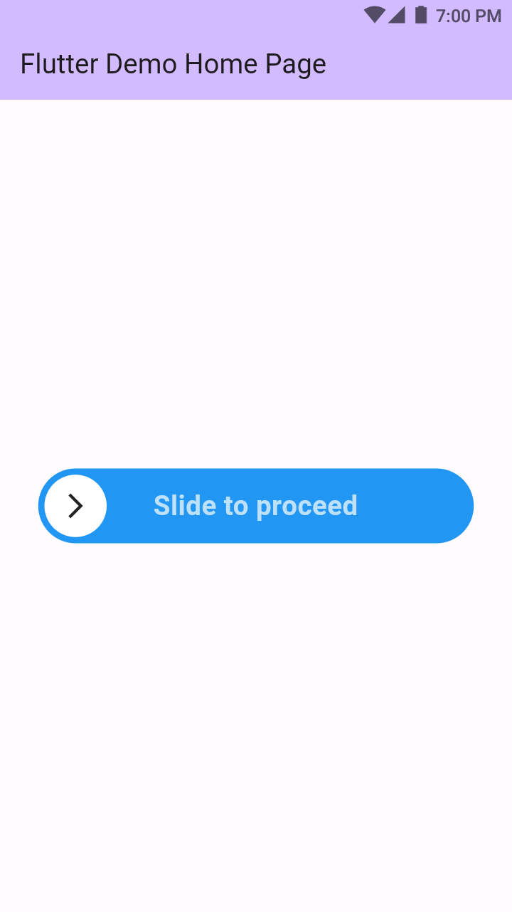

[](https://pub.dev/packages/sliding_button)

A sliding Flutter widget, which helps to start an event based on user interaction. Highly customizable and flexible.

## Screenshots


<br>

## Features

- Highly customizable
- Easy to use

## Getting started

1. Import the package.

```Dart
 import 'package:sliding_button/sliding_button.dart';
```

2. Use the widget in your code.

```Dart
 SlidingButton(
          width: 400,
          height: 60,
          backgroundColor: Colors.blue,
          foregroundColor: Colors.white,
          iconColor: Colors.blue,
          text: 'Slide to proceed',
          shadow: const BoxShadow(color: Colors.transparent),
          onConfirmation: () {},
          child: const Icon(Icons.arrow_forward_ios),
        ) 
```

## Usage

**This full code is from the example folder. You can run the example to see.**

```dart
import 'package:flutter/material.dart';
import 'package:sliding_button/sliding_button.dart';

void main() {
  runApp(const MyApp());
}

class MyApp extends StatelessWidget {
  const MyApp({super.key});
  @override
  Widget build(BuildContext context) {
    return MaterialApp(
      debugShowCheckedModeBanner: false,
      title: 'Flutter Demo',
      theme: ThemeData(
        colorScheme: ColorScheme.fromSeed(seedColor: Colors.deepPurple),
        useMaterial3: true,
      ),
      home: const MyHomePage(title: 'Flutter Demo Home Page'),
    );
  }
}

class MyHomePage extends StatefulWidget {
  const MyHomePage({super.key, required this.title});
  final String title;
  @override
  State<MyHomePage> createState() => _MyHomePageState();
}

class _MyHomePageState extends State<MyHomePage> {
  @override
  Widget build(BuildContext context) {
    return Scaffold(
      appBar: AppBar(
        backgroundColor: Theme.of(context).colorScheme.inversePrimary,
        title: Text(widget.title),
      ),
      body: Center(
        child: Column(
          mainAxisAlignment: MainAxisAlignment.center,
          children: <Widget>[
            SlidingButton(
              width: 400,
              height: 60,
              backgroundColor: Colors.blue,
              foregroundColor: Colors.white,
              iconColor: Colors.blue,
              text: 'Slide to proceed',              
              shadow: const BoxShadow(color: Colors.transparent),
              onConfirmation: () {},
              child: const Icon(Icons.arrow_forward_ios),
            )
          ],
        ),
      ),
    );
  }
}
```

## Custom Usage
There are several options that allows for more control:

|  Properties  |   Default   |   Description   |
|--------------|-----------------|--------------|
| `height` | null ?? 70 | Gives a height to a widget |
| `width` | null ?? 300 | Gives a width to a widget |
| `backgroundColor` | Colors.white | Gives a background color to a widget |
| `backgroundColorEnd` | null | Gives a background color to a widget while dragged |
| `foregroundColor` | Colors.blueAccent | Gives a color to a slidder button |
| `label` | Slide to proceed | A text widget which assigns a label |
| `labelStyle` | Colors.white70, FontWeight.bold | Assigns label TextStyle |
| `shadow` | Colors.black38, Offset(0, 2), blurRadius: 2 | Gives a shadow to a slidder button |
| `stickToEnd` | false | Make it true if the Icon need to be placed in the end position |
| `action` | null | (required) Define an action after sliding a button |
| `child` | Icons.chevron_right | For more customizable button add your own widget |

<br>
<br>
